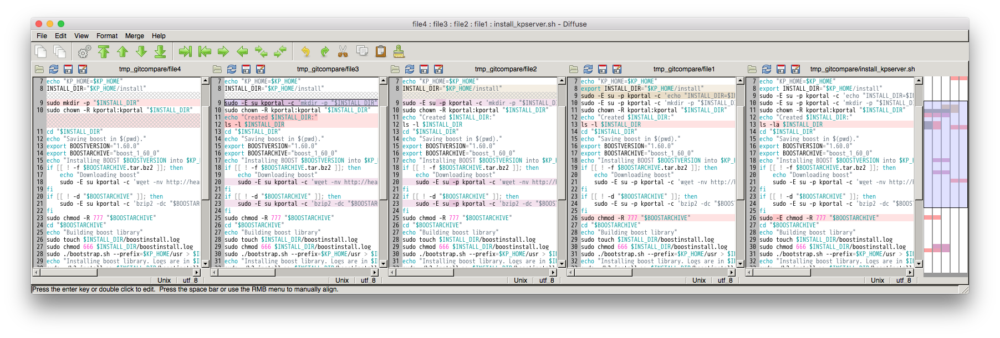

# Gitcompare

Compare changes in one file between last N commits of git repository.

Requires diffuse (http://diffuse.sourceforge.net).

## Usage

```./gitcompare.sh <filename> <number of commmits>```

For example:
```./gitcompare.sh install_kpserver.sh 5```
Screenshot:
